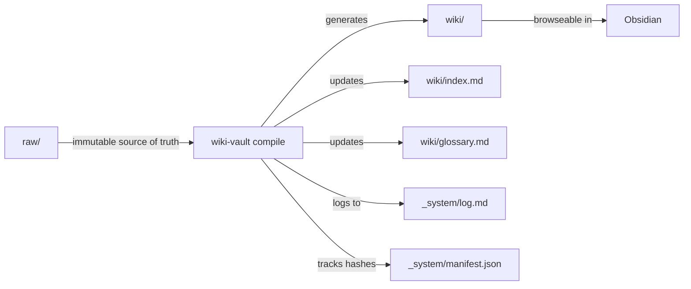

# wiki-vault

Turn raw sources into structured, interlinked Obsidian wikis.

Inspired by [Andrej Karpathy's "How I use LLMs"](https://karpathy.ai/) pattern: maintain a personal wiki where an LLM reads your raw sources, extracts concepts, and generates cross-linked wiki articles — all versioned in git and browseable in Obsidian.

## How it works

```
raw sources (articles, papers, data)
        |
        v
    wiki-vault ingest     # copies into raw/, catalogs, hashes
        |
        v
    wiki-vault compile    # extracts concepts, generates wiki pages
        |
        v
    cross-linked wiki     # browseable in Obsidian, versioned in git
```

### Architecture



**Three layers:**
- `raw/` — Immutable. Your source files go here via `ingest`. Never modified by the tool.
- `wiki/` — LLM-owned. Generated articles with frontmatter, wikilinks, and citations.
- `_system/` — Operational metadata: catalog, manifest, log, config, prompts.

## Install

Requires Python 3.12+.

```bash
git clone https://github.com/youruser/wiki-vault.git
cd wiki-vault
pip install -e .
```

## Usage

### Create a vault

```bash
wiki-vault init my-research
cd my-research
```

Creates the full directory structure, CLAUDE.md, config.yaml, .obsidian config, and initializes git.

### Ingest sources

```bash
# Local files
wiki-vault ingest paper.pdf article.md data.csv

# URLs
wiki-vault ingest --url https://example.com/article

# Ingest and compile in one step
wiki-vault ingest --compile paper.pdf
```

Files are copied to the appropriate `raw/` subdirectory based on extension:
- `.md` → `raw/articles/`
- `.pdf` → `raw/papers/`
- `.csv`, `.json`, `.tsv` → `raw/datasets/`
- Images → `raw/images/`

### Compile wiki

```bash
# Interactive mode (review concepts before generation)
wiki-vault compile

# Batch mode (unattended)
wiki-vault compile --batch
```

Compilation is **incremental** — only sources with changed content (SHA-256) or `pending-compile` status are processed. Re-running with no changes is a no-op.

### Two-phase compilation

1. **Phase 1 — Extract:** Reads all pending sources, builds a unified concept manifest (entities, concepts, topics with source attribution).
2. **Phase 2 — Generate:** Creates or updates wiki pages from the manifest, maintaining cross-links, index, and glossary.

## Vault structure

```
my-research/
├── raw/                    # Immutable source layer
│   ├── articles/
│   ├── papers/
│   ├── repos/
│   ├── datasets/
│   └── images/
├── wiki/                   # LLM-generated knowledge layer
│   ├── concepts/
│   ├── topics/
│   ├── entities/
│   ├── index.md
│   └── glossary.md
├── output/                 # Rendered artifacts
│   ├── reports/
│   ├── slides/
│   └── charts/
├── _system/                # Operational metadata
│   ├── config.yaml
│   ├── catalog.md
│   ├── manifest.json
│   ├── log.md
│   └── prompts/
├── .obsidian/
├── CLAUDE.md               # Agent operating instructions
└── .gitignore
```

## Key features

- **Hash-based incremental compilation** — only recompiles when sources actually change
- **Bidirectional wikilinks** — articles cross-reference each other via `[[wikilinks]]`
- **Git auto-commit** — every operation creates a commit
- **Obsidian-native** — opens directly in Obsidian with graph view, Dataview queries, backlinks
- **$0 operating cost** — fully local, no API keys required
- **CLAUDE.md co-evolution** — agent instructions evolve alongside the wiki

## License

MIT
