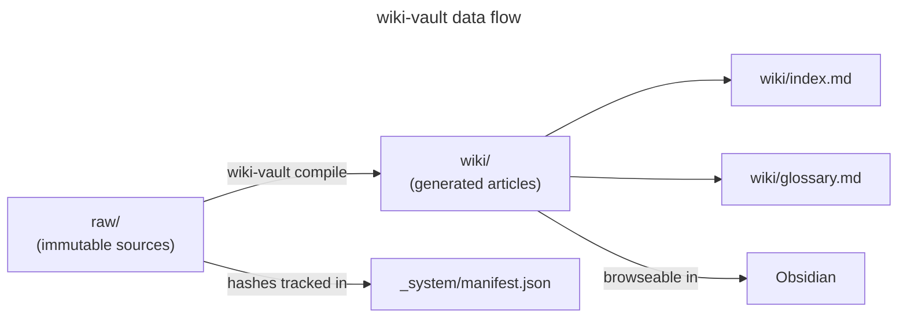

<!--
  README generated by the github-readme skill.
  Placeholders use ALL_CAPS_WITH_UNDERSCORES — find-and-replace to customize.
-->

<!-- Banner: dark/light adaptive via <picture> element with prefers-color-scheme -->
<p align="center">
  <picture>
    <source media="(prefers-color-scheme: dark)" srcset="./assets/banner-dark-v1.svg">
    <source media="(prefers-color-scheme: light)" srcset="./assets/banner-light-v1.svg">
    
  </picture>
</p>

<!-- Badges -->
<p align="center">
  <a href="LICENSE"></a>
  <a href="https://www.python.org/downloads/"></a>
  <a href="https://github.com/ConsultingFuture4200/wiki-vault/releases"></a>
</p>

<!-- One-liner -->
<p align="center"><strong>A CLI that reads your raw sources, extracts concepts, and generates cross-linked wiki articles — all versioned in git and browseable in Obsidian.</strong></p>

---

<p align="center">
  
</p>
<!-- TODO: Replace PROJECT_SCREENSHOT_URL with a screenshot of the Obsidian graph view or terminal output -->

## About

wiki-vault bridges the gap between a pile of bookmarked articles, papers, and datasets and a structured knowledge base you can actually navigate. Inspired by [Andrej Karpathy's approach][karpathy] to maintaining a personal wiki, it automates the tedious parts — ingestion, concept extraction, cross-linking — so you can focus on building understanding rather than formatting notes.

Everything runs locally. No API keys, no cloud services, no recurring costs.

## Features

- **Hash-based incremental compilation** — only recompiles sources whose content has actually changed (SHA-256)
- **Two-phase extraction** — first extracts a unified concept manifest, then generates interlinked wiki pages from it
- **Bidirectional wikilinks** — every article cross-references related concepts via `[[wikilinks]]`
- **Git auto-commit** — every `ingest` and `compile` operation creates a versioned commit automatically
- **Obsidian-native** — opens directly in Obsidian with graph view, Dataview queries, and backlinks working out of the box
- **Zero operating cost** — fully local, no API keys required
- **CLAUDE.md co-evolution** — agent operating instructions evolve alongside the wiki content

## Quick Start

> [!IMPORTANT]
> Requires Python 3.12 or higher. Run `python --version` to verify.

```bash
git clone https://github.com/ConsultingFuture4200/wiki-vault.git
cd wiki-vault
pip install -e .
```

```bash
wiki-vault init my-research
cd my-research
```

> [!TIP]
> Open the generated `my-research/` folder in Obsidian immediately — the `.obsidian/` config is pre-configured.

## Usage

### Ingest sources

```bash
# Local files
wiki-vault ingest paper.pdf article.md data.csv

# URLs
wiki-vault ingest --url https://example.com/article

# Ingest and compile in one step
wiki-vault ingest --compile paper.pdf
```

Files are routed to the appropriate `raw/` subdirectory by extension:

| Extension | Destination |
|-----------|-------------|
| `.md` | `raw/articles/` |
| `.pdf` | `raw/papers/` |
| `.csv`, `.json`, `.tsv` | `raw/datasets/` |
| Images | `raw/images/` |

### Compile the wiki

```bash
# Interactive — review extracted concepts before generation
wiki-vault compile

# Batch — unattended, no prompts
wiki-vault compile --batch
```

Compilation is incremental. Re-running with no source changes is a no-op.

<details>
<summary>How two-phase compilation works</summary>

1. **Phase 1 — Extract:** Reads all pending sources, builds a unified concept manifest containing entities, concepts, and topics with source attribution.
2. **Phase 2 — Generate:** Creates or updates wiki pages from the manifest, maintaining cross-links, the master index, and the glossary.

Only sources with changed content (by SHA-256 hash) or `pending-compile` status are processed.

</details>

## Architecture



### Vault structure

<details>
<summary>Full directory layout</summary>

```
my-research/
├── raw/                    # Immutable source layer
│   ├── articles/
│   ├── papers/
│   ├── repos/
│   ├── datasets/
│   └── images/
├── wiki/                   # LLM-generated knowledge layer
│   ├── concepts/
│   ├── topics/
│   ├── entities/
│   ├── index.md
│   └── glossary.md
├── output/                 # Rendered artifacts
│   ├── reports/
│   ├── slides/
│   └── charts/
├── _system/                # Operational metadata
│   ├── config.yaml
│   ├── catalog.md
│   ├── manifest.json
│   ├── log.md
│   └── prompts/
├── .obsidian/
├── CLAUDE.md
└── .gitignore
```

</details>

Three layers keep concerns cleanly separated:

| Layer | Path | Ownership | Purpose |
|-------|------|-----------|---------|
| Source | `raw/` | You | Immutable files added via `ingest` — never modified by the tool |
| Knowledge | `wiki/` | LLM | Generated articles with frontmatter, wikilinks, and citations |
| System | `_system/` | Tool | Catalog, manifest, log, config, prompt templates |

## Built With


## Roadmap

- [x] `init` command with full vault scaffolding
- [x] `ingest` with file-type routing and SHA-256 hashing
- [x] `compile` with two-phase extraction and incremental builds
- [ ] `export` command for rendering reports and slides from wiki content
- [ ] Plugin system for custom source parsers
- [ ] Multi-vault cross-referencing

## Contributing

Contributions are welcome — whether that's new source parsers, better extraction prompts, or improved wikilink resolution. Open an issue to discuss or submit a pull request.

## License

[MIT](LICENSE)

<!-- Reference-style links -->
[karpathy]: https://karpathy.ai/
